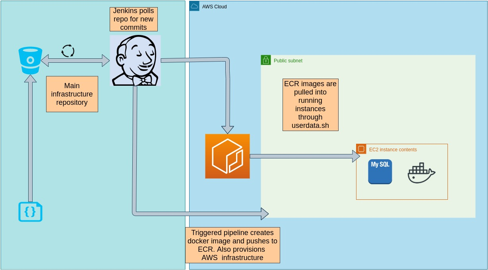
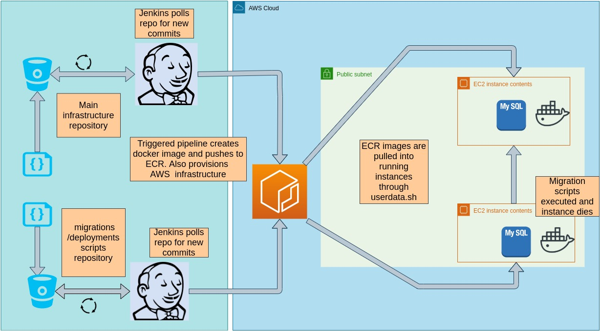

# Provisioning

We make use of a Jenkins pipeline. The pip-line runs under a custom build agent which can run Terraform and AWS cli commands. Once built, our images are published to a repository in the AWS Elastic Container Registry (private).

Prerequisites for running Terraform

1. Configure AWS credentials in Jenkins for aws jenkins user
2. Pre-create the vpc
3. Pre-create the public subnet
4. Pre-create private key
5. I've redacted the aws account number in the jenkins and terraform files with '0123456789' this will have to be corrected in live demonstration.

Prerequisites for running AWS cli

1. Configure AWS credentials in Jenkins

Below is a diagram of our pipeline.



To do package deployments and migrations, we would construct a seperate pipeline. We  create a repository for our migration scripts, this will contain a docker file and script files.
Ultimately we'll be deploying an EC2 instance in the same subnet as the currently deployed EC2 instnace. This new EC2 instance runs a mysql docker container (which we'll be running as client) The mysql client will point to the  msql server host and  execute all desired SQL scripts. We can then destroy the provisioned container and infratructure once execution has completed. The pipeline is demonstrated in diagram below.



 This configuration will have to be duplicated for other environments (dev, QA, prod) such that each runs its own pipeline and uses seperate resources in distinct AWS accounts. At a source level, each environment's scripts live in a dedicated branch, and a terraform workspace will be allocated to each environment.

The provisioning process can be improved by automating some of the prerequisites listed above, such as creating the vpc and public subnet and through output values plug the relevant vpc_id
and subnet_id when provisioning EC2 instances.

For a more secure architecture, we can provision the EC2 instance in a private subnet, and provision a NAT gatway allowing our instance to connect to the internet to update yum,
install docker, etc as well as connect to other AWS services. We can then configure a security group to allow traffic only from  EC2 instances which can run migrations and configuration scripts.

# Resilience

To build a more resilient architecture we could leverage the following technologies

## Scaling (Amazon EC2 Auto Scaling Groups)

### Motivation

We can onfigure a minimum number of running instances using Auto Scaling groups. This service will run health checks on our instances and provision new instances and terminate the instances for which the health checks fail. This ensures that the we always have a minimun nummber of EC2 instances running and thus increases the availability of our MySql server.

### Patterns

#### Scheduled scaling

Since we're anticipating increased traffick on black friday we can use this pattern to schedule scaling for this scenario. The scaling will be done automatically as per the schedule and gives us extra capacity to handle the predicted traffick spikes.

## Monitoring (Cloud Watch Logs)

### Motivation

We can use cloud watch logs to monitor the health of our resources. You can create alarms which watch metrics and send notifications or automatically make changes to the resources you are monitoring. This enables us to react timeously to changes in resources being utilized. 
We can for instance monitor the amount of disk reads and writes of your Amazon EC2 instances and configure auto scaling based on this metric.

## Caching (Elasticache)

### Motivation

We can increase the performance and availability of our application through caching common requests. Elasticache is an in mememory datastore which we can leverage to improve performance, as this gives us faster load times rather than database reads and writes which is traditionally more expensive and slower.

## Load balancing

A load balancer will enable us to distribute traffick amongst available computing resources such as EC2's. Using a load balancer increases the availability and fault tolerance of your applications. When we scale our database across multiple Availability Zones, we'll register our instances with the load balancer. Every instance that fails a health check in an Auto Scaling group will no longer be registered with the load balancer.

# SQL Queries

## Query1

Query

``` SQL
SELECT t.day_of_week FROM (SELECT 
    COUNT(DAYNAME(order_date)) AS 'number_of_orders',
    DAYNAME(order_date) AS 'day_of_week'
FROM
    northwind.orders
GROUP BY day_of_week
ORDER BY number_of_orders DESC
LIMIT 1) t;
```

Result

``` md
Saturday
```

## Query2

Query

``` SQL
SELECT  count(Time(order_date)) as 'number_of_orders', TIME(order_date) as 'time_of_day'
FROM northwind.orders
GROUP BY time_of_day
ORDER BY number_of_orders DESC
LIMIT 1;
```

## Query3

This query applies to a specific customer so we require to set a variable to tame the customer_id. Here i've used an example with 
custmer_id=32  

Query

``` SQL
SET @customer_id := 32;
SELECT t.product FROM
(SELECT 
    COUNT(p.product_name) AS 'count_d', p.product_name as 'product'
FROM
    northwind.order_details od 
INNER JOIN northwind.products p on p.id = od.product_id
WHERE
    order_id IN (SELECT 
            MIN(id)
        FROM
            northwind.orders o
        WHERE
            customer_id = @customer_id
        GROUP BY order_date ASC)
GROUP BY p.product_name
ORDER BY count_d DESC
LIMIT 1) t
```

Result

``` md
Canon T90
```


## Query5

We first select the max date.

``` SQL
SELECT @max_date := max(order_date);
FROM northwind.orders;
```

We use the shipping fee to characterize the duplicates, as this will be repeated. Whereas the order id is guaranteed to be unique. Then we look for equality on different fields. We only keep the row with the smaller id.

Query

``` SQL

DELETE a_orders FROM northwind.orders a_orders
        INNER JOIN
    northwind.orders b_orders 
WHERE
    a_orders.id > b_orders.id
    AND a_orders.shipping_fee = b_orders.shipping_fee
    AND a_orders.customer_id = b_orders.customer_id
    AND a_orders.employee_id = b_orders.employee_id
    AND a_orders.order_date = @max_date

```

Result

``` md
None
```
